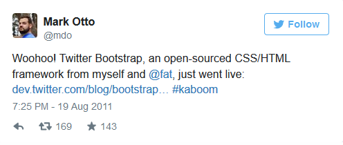
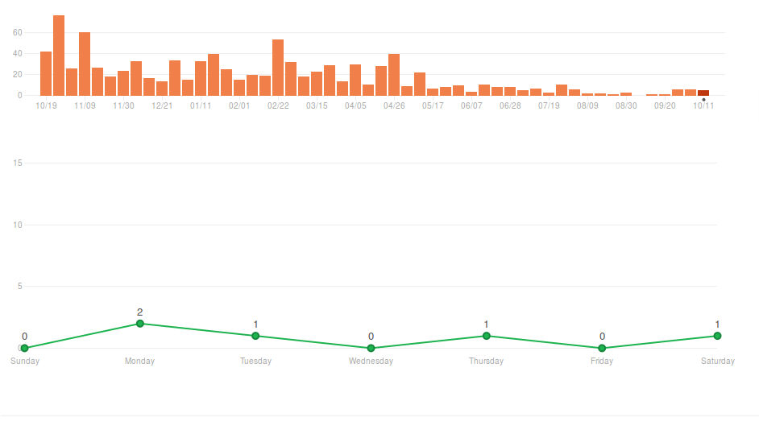

#Engenharia de Software - 1º Relatório

##Bootstrap - Processes 

##Descrição do Projecto

O [Bootstrap](http://getbootstrap.com/) é um front-end framework [open-source](https://github.com/twbs/bootstrap) de HTML, CSS e Javascript que providencia um conjunto de ferramentas para a criação de websites e aplicações web. 

Criado pela dupla de designers e programadores [Mark Otto](https://github.com/mdo) e e [Jacob Thornton](https://github.com/fat), no Twitter, em 2010, o projecto é actualmente mantido pelos criadores em conjunto com um pequeno grupo de contribuidores, contando também com o apoio da comunidade.

##Características
O Boostrap é compatível com as mais recentes versões de browsers como [Google Chrome](https://en.wikipedia.org/wiki/Google_Chrome), [Firefox](https://en.wikipedia.org/wiki/Firefox), [Internet Explorer](https://en.wikipedia.org/wiki/Internet_Explorer) e [Safari](https://en.wikipedia.org/wiki/Safari_(web_browser)), embora alguns destes browsers não são suportados em todas as plataformas.
Bootstrap vai actualmente na versão 3.3.5 e desde a versão 2.2.5 que esta framework suporta [*responsive web design*](https://en.wikipedia.org/wiki/Responsive_web_design), ou seja, mediante o dispositivo a ser usado (tablet, desktop, telemóvel), o layout das ṕáginas ajuda-se dinamica e optimizada, o que permite abranger um número muito maior de utilizadores e assim explorar e melhorar todo o seu desenvolvimento. 
Com o Bootstrap 3.0, o projecto foi reescrito para ser *mobile friendly* enfatizando o *responsive design* por defeito.
Existe já uma versão do Bootstrap 4.0 alpha que adicionou [Sass(style sheet designing)](https://en.wikipedia.org/wiki/Sass_%28stylesheet_language%29) e [CSS Flex Box(último modelo vindo do CSS3)](https://en.wikipedia.org/wiki/CSS_Flex_Box_Layout) suporte.  

##História do Projecto
Este projecto, inicialmente designado **Twitter Blueprint**, foi desenvolvido por [Mark Otto](https://github.com/mdo) e [Jacob Thornton](https://github.com/fat) em 2010. Tudo começou no **Twitter** como uma *framework* para encorajar consistência através de ferramentas internas. Antes do Bootstrap, muitas *libraries* foram usadas para desenvolvimento de interfaces o que levou a muitas inconsistências e a um custo muito elevado. O fundador, Mark Otto, tem uma afirmação que explica mesmo isso e mostra como foi inaugurada e criada esta ideia:

>A super small group of developers and I got together to design and build a new internal tool and saw an opportunity to do something more. **Through that process, we saw ourselves build something much more substantial than another internal tool. Months later, we ended up with an early version of Bootstrap as a way to document and share common design patterns and assets within the company.**

Após alguns meses de um desenvolvimento coordenado por um grupo pequeno, muitos fãs no **Twitter** começaram a contribuir para o projecto através de um evento chamado *Hack Week*. *Hack Week* é um evento organizado pelo Twitter onde vários programadores estão envolvidos em desenvolvimento de software e hardware. O termo provém de [Hackathon](https://en.wikipedia.org/wiki/Hackathon) que junta *graphic designers*, *interface designers* e *project managers* que colaboram exaustivamente em projectos de software. Foi aí que surgiu a mudança de nome de **Twitter Blueprint** para **Bootstrap** e o lançamento como *open source* projecto no dia 19 de Agosto de 2011. 

O projecto continuou a ser mantido por [Mark Otto](https://github.com/mdo), [Jacob Thornton](https://github.com/fat) e um pequeno grupo-núcleo de *developers* e uma larga comunidade de contribuidores. 
Em Janeiro de 2012, a versão Bootstrap 2 foi anunciada e posteriormente, a 19 de Agosto de 2013, a versão 3 com novidades inovadoras e aliciantes como *responsive design*.
Entretanto, a 29 de Outubro de 2014 [Mark Otto](https://github.com/mdo) anunciou que a versão 4 se encontra em desenvolvimento. A primeira versão alpha do Bootstrap 4 foi implantada a 19 de Agosto de 2015. 

##Funcionamento e Estrutura

######Exemplo de uma webpage a utilizar Bootstrap framework no Mozilla Firefoxe (from Wikipedia)

O Bootstrap é modular e consiste essencialmente numa serie de [LESS stylesheets](https://en.wikipedia.org/wiki/Less_%28stylesheet_language%29) que implementam as várias componentes da *toolkit*. 
Uma stylesheet é uma forma de separação de apresentação e conteúdo para *web design* onde o [markup](https://en.wikipedia.org/wiki/Markup_language) (i.e., HTML ou XHTML) de uma página web contém o conteúdo e estrutura da página mas que não define o seu *visual layout*(estilo). Uma **stylesheet** chamada *bootstrap.less* inclui todos os *stylesheet component*. Cada *bootstrap developer* pode, assim, adaptar o próprio ficheiro, selecionando os componentes que querem utilizar no seu projecto.
Ajustes são possíveis até uma extensão limitada atraveś de uma stylesheet de configuração "central". Modificações mais robustas são possíveis através de **LESS declarations**.
Desde a versão 2.0, a configuração do Bootstrap tem também uma opção especial de "Customize" na documentação. Além disso, o *developer* escolhe as componentes que pretende e ajusta, se necessário, os valores das várias opções para as suas necessidades. O *package* subsquentemente gerado já inclui uma *stylesheet* CSS pré-feita. 

 web style sheet is a form of separation of presentation and content for web design in which the markup (i.e., HTML or XHTML) of a webpage contains the page's semantic content and structure, but does not define its visual layout (style)

##Análise crítica do Processo
 
  Muito provavelmente, a força locomotora e o que mais impulsionou este projecto foi o grande "boom" das aplicações Web nos dias de hoje. Bootstrap, foi ganhando admiradores e seguidores por todos os cantos do mundo, que não largaram os seus criadores que outrora eram meros twitter "nerds". Não subestimando o trabalho árduo e o engenho deste grupo, acreditamos que se criou um ambiente favorável para que as coisas progredissem naturalmente. 
Quanto ao processo de desenvolvimento, pensamos que possa ter sido seguido o modelo iterativo e incremental Agile, uma vez que é priveligiada a interacção (feedback) com os utilizadores, estando a equipa de desenvolvimento, constantemente receptiva a fazer alterações ao software, induzidas pelas necessidades que forem surgindo. Verifica-se também que é tido em conta a boa estruturação do código, assim como documentação que permite um desenvolvimento mais consistente.
Temos quase uma distinção hierárquica neste projecto, onde a core team continua a desenvolver as várias releases do projecto, a desenvolver novos templates, extensões; os vários contribuidores que vão explorando e analisando possíveis bugs que são remetidos para alguém que trata dos pull requests e assim mantém o projecto actualizado e adaptado a todas as exigências que vão surgindo. Como referimos em cima, a estratégia dos fundadores deste projecto é simples e eficaz e em termos de custos, acreditamos ser bastante razoável. À imagem de quase todos os software open source dos dias de hoje, esta equipa conta com um lote enorme de pessoas que fazem o projecto evoluir, mas o que provavelmente marca Bootstrap como o projecto mais aliciante do GitHub é a maneira concisa e apurada com que se fazem chegar a todos os que desenvolvem em ambiente WEB; a todas as pessoas que programam em HTML, em CSS, JavaScript, Ruby e tantas outras linguagens de programação que são imprescindíveis nos dias de hoje. Cursos online usam bootstrap, livros aconselham bootstrap e referem-se a este projecto como uma dádiva. 
Bootstrap ganhou uma relevância notória nos dias de hoje, muito por mérito da maneira como surgiram e como mantiveram um core group que prevalece nos dias de hoje. Junto com esta breve análise, apresentamos um conjunto de gŕaficos que mostram isso mesmo. Mark Otto, Jacob Thornton , "fat" e Chris Rebert continuam a fazer commits, insertions, deletions e mantêm homogeneidade ao longo dos anos. Desta observação pode-se concluir algo muito importante e fulcral nos dias de hoje, este e qualquer projecto nunca teria alcançado tamanho sucesso sem a perseverança e consistência deste grupo.

Como podemos analisar pelo gráfico, o projecto ainda se encontra em desenvolvimento. A frequência de commits, embora bastante distante dos números de Abril (relembre-se que foi na altura do *deploy* da versão 4.0), continua a acontecer com alguma frequência. Estes dados são expectáveis porque olhamos para um projecto "terminado", cuja fase 4 está num estado alfa há mais de um ano. Corrobora-se pelo gráfico que os número de commits têm vindo a diminuir, sem perder a sua actividade, no entanto.

Contactámos os criadores do projecto por e-mail, fazendo algumas perguntas que achamos oportunas para nos inserirmos um pouco mais por dentro do tema, contudo, até ao momento, não obtivemos resposta, pelo que, as conclusões que obtivémos podem, como é óbvio, não corresponder à verdade.

## Referências
<a name="ref1" href="https://en.wikipedia.org/wiki/Bootstrap_%28front-end_framework%29">1) Bootstrap - Wikipedia</a> 
<a name="ref2" href="https://moodle.up.pt/pluginfile.php/68505/mod_resource/content/2/ESOF-Requirements%20Engineering.pdf">2) Slides Moodle </a>
<a name="ref3" href="https://http://getbootstrap.com/css/">3) Bootstrap CSS</a> 
<a name="ref4" href="https://github.com/twbs/bootstrap/graphs/commit-activity">4) Bootstrap - Commit Activity </a> 

####Trabalho realizado por:
* Luís Costa - luistelmocosta@gmail.com / 200806068
* Alexandre Ribeiro

