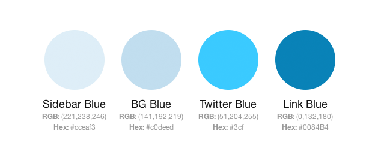
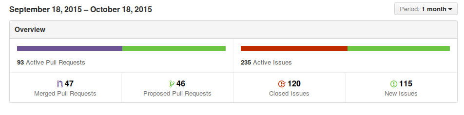
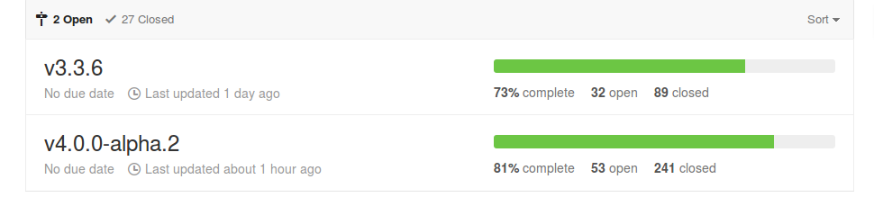
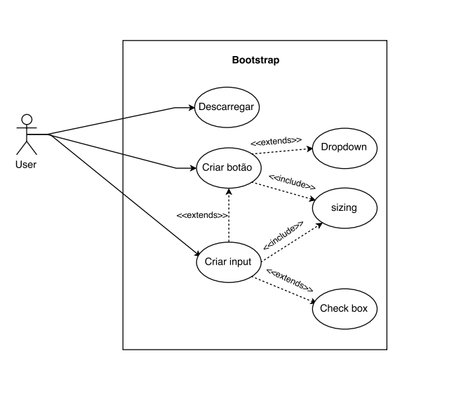

#Engenharia de Software - 2º Relatório

##Bootstrap - Requirements

###Introdução

Para que tenhamos uma leitura e compreensão correcta dos requisitos é necessário atentar nas diferentes fases deste projecto, recorrendo mais uma vez, aos seus processos e história. Toda esta investigação e pesquisa é crucial para que se entenda quais são as causas e motivos que fazem o bootstrap uma ferramenta tão optimizada e próxima do seu público, questão que é inerente ao levantamento dos requisitos, pois há uma correlação entre as necessidades do utilizador e a evolução de um projecto. 

[Mark Otto](https://github.com/mdo) mostra essa mesma preocupação, em acompanhar a comunidade na seguinte afirmação:

>Today, Bootstrap includes dozens of components with many more planned, but only as their need and functionality are clearly identified using the process we established early on. Jacob and I iterate on the toolkit by managing feature requests and tracking issues and bugs. **We work together to evaluate each new item to measure its usefulness to the community. We only implement a new feature if it doesn’t confuse users or unnecessarily inflate the framework. Having a process in place that allows folks to equally evaluate new features is incredibly powerful and necessary to the project. Our collaboration has extended well beyond the reach of a single project and into every one since then, especially Bootstrap.**

###Requisitos - o contexto.

Nos primórdios do Twitter, engenheiros usavam qualquer *library* que lhes era familiar para cumprir com os *front end requirements*. Porém, algumas inconsistências a nível de aplicações individuais surgiam e tornavam muito mais dificil manter e escalar esses requisitos. Bootstrap apareceu como uma resposta a estes obstáculos e foi ganhando preponderância com uma rapidez formidável. A grande aceleração desse relevo acontece logo na primeira semana do *Twitters Hackweek*[[1]](#ref1). No final do evendo, tinha sido atingido uma versão estável do projecto que já permitia que os engenheiros utilizassem em prol da companhia. 
Com a ajuda e *feedback* de muitos engenheiros, Bootstrap foi conhecendo e assimilando cada vez mais requisitos, numa evolução sagaz e eficiente que traria vantagens tanto para criadores como para os seus inúmeros fãs. Bootstrap foi crescendo significantemente e desde cedo tentou abranger não só os *basic styles*, mas também os mais elegantes e fiáveis *front end design patterns*. Estavam assim reunidas as condições para o lançamento e *open sourcing* de vários meses de árduo trabalho.

**Mas que necessidades estão associadas ao Bootstrap? O que oferecia este projecto que cativava tanto os seus utilizadores?**

* Bootstrap deve ser fácil de usar e implementar. Não deve interessar o nível de conhecimentos e *skill* da pessoa que usa. Todos devem ser capazes de utilizar as diferentes componentes do Bootstrap e optimizar o seu projecto.
* Como consequência da necessidade acima indicada, bootstrap deve poder colaborar com todos os contribuidores possíveis, sejam estes engenheiros, *designers*, *twitters*, estudantes. Todos devem ser capaz de ter uma participação activa no projecto e ajudar com a sua experiência e ferramentas. **Esta é um aspecto importantíssimo em projectos *open source*. Quantos mais utilizadores e aplicações estivessem envolvidas com o projecto, maior seria o número de *requests*, maior teria de ser a capacidade de resposta deste grupo, maior teria de ser a responsabilidade de agradar a todos. Os requisitos tinham a sua essência no público e assim, tornavam-se objectos de evolução e crescimento.**
* Bootstrap deve ser uma ferramento que facilita e que ajuda quem o pratica. Como dito acima[[1]](#ref1) Bootstrap teve o seu *boom* na primeira *Hackweek* do Twitter. Durante essa semana, o criador, [Mark Otto](https://github.com/mdo), ajudou alguns utilizadores a usar Bootstrap nos seus projectos para acelerar o seu desenvolvimento, mas para a sua própria surpresa, o que acabara de desenvolver era altamento eficiente e estava completamente difundido.

> I had no idea how effective or widespread the toolkit would become. When all the teams got in front of the company to present their ideas, dozens of them were using Bootstrap. They had used Bootstrap to create projects that all felt like a family of ideas with a consistent design and implementation. A simple, well-designed, and documented toolkit saved countless hours with little to no help from a dedicated designer.
> Put another way, **it worked!**

#####Evolução através de colaboração

Destacamos aqui um pequeno-importante tópico na evolução do Bootstrap, a evolução através de colaboração.
No ínicio, Bootstrap apenas incluía tipografia, tabelas e formas, um guia de cores e alguns **graphical assets**.

Quantas mais pessoas e aplicações se envolviam com o projecto, mais funcionalidades eram pedidas e sugeridas. Desde *"Make this look better"* ou *"build this"* até *"how can we solve this problem?* - e o bootstrap propspera nisso. O processo colaborativo ajudou a trabalhar de uma maneira mais eficiente e a construir uma confiança entre a equipa em si e o público. 

##Das necessidades aos requisitos

Destacadas algumas necessidades, passamos a uma formalização mais estruturada dos requisitos que poderiam ter sido utilizados.

######Requisitos funcionais

* O software deve permitir criar web sites responsivos (a partir da versão 2.0), isto é, providenciar uma boa experiencia de navegação num largo espectro de dispositivos;
* O software deve providenciar um aspecto moderno dos elementos de uma página web;
* O software deve poder ser integrado em código já produzido assim como deve permitir compatibilidade com os elementos web mais recentes;
* O software deve permitir que o utilizador possa gerir os seus vários componentes, através de um gerenciador de packages, ou mesmo através do override de comportamentos do CSS e/ou JavaScript;

######Requisitos não funcionais

* O software deve poder ser utilizado na maior parte dos browsers, tanto desktop como moveis, embora, para uma melhor experiencia, seja recomendado o uso de versões recentes;

* O software deve estar bem e integralmente documentado para que mesmo utilizadores com menos experiência o possam utilizar com facilidade;

* O software deve permitir que o utilizador poupe esforço ao desenvolver conteudo web;

* O software deve tirar proveito do apoio da comunidade para continuar a melhorar;

* O software deve seguir certas regras no que diz respeito à numeração de versões, para manter um ciclo de desenvolvimento coerente e para evitar problemas de retrocompatibilidade;

###Contexto Actual

Nos dias de hoje e muito por causa do modelo *open source* a gestão de requisitos não é tão cuidada e mapeada como no contexto inicial. À medida que a comunidade vai evoluindo os métodos proliferam, a organização perde rigor e torna-se muito mais complicado obedecer e aplicar os métodos base de Engenharia de Software.

####Elicitação dos requisitos

Para que haja uma atenção cuidada a todos os requisitos e sugestões que são feitas em relação ao projecto, as equipas de software *open source* abrigam-se em duas funcionalidades existentes no *GitHub*: **issues** e **pull requests**. Estas duas funcionalidades estão disponíveis para o público em geral e para a própria equipa de desenvolvimento. É importante distinguir em que consistem cada um desdes conceitos. **Issues** alertam para a existência de anomalias e servem também, para solicitar a implementação de novas funcionalidades. Os **pull requests** derivam das **issues** de modo a que a cada **isse** se possa responder com o **pull request** adequado e assim modificar o código fonte, algo da competência do *core group*, responsável por corrigir bugs e analisar cada solicitação que permita melhorar o projecto.

####Negociação e análise

O Bootstrap encontra-se dividido em vários [*packages*](https://atmospherejs.com/packages/Bootstrap). Existem mais de 400 **packages** disponíveis para Bootstrap. Esta é uma estratégia que permite a categorização e separação dos requisitos. A expansibilidade do Bootstrap, com a utilização de *packages* faz com que seja possível uma aprimorização e filtragem da quantidade e qualidade dos *requests* feitos e da sua importância para o projecto. A cada *package* está associado um repositório independente capaz de lidar com os *pull requests* e *issues* que poderão existir por parte da comunidade. As solicitações podem ser exageradamente elevados e não há garantia que cada uma delas é vital ao funcionamento e qualidade do software. É preciso existir critério e precisão no que toca à análise e projecção de cada pedido e é humanamente impossível que apenas um grupo seja capaz de cuidar e resolver todas as exigências a que estão expostos. 
Dada a compartimentalização dos requisitos convém apurar aqueles que são essenciais e vitais à integridade do projecto, como por exemplo, requisitos que estejam ligados à API. Esta é a mais delicada parte com que o core group tem que lidar e é muito importante que nunca seja posta em causa a integridade do projecto bem como a sua performance. É necessário assegurar que nenhuma modificação feita irá prejdicar o comportamento correcto da API e as *packages* que estão dependentes disso. 

Para que tudo corra dentro dos termos correctos é necessário que haja uma **priorização** dos requisitos e que estes sejam hierarquizados por ordem de relevância e funcionalidade. Tem que haver também permanente contacto entre a *core team* para que as alterações não tenham um efeito avassalador. Tópicos referentes à API têm que ser cuidados de uma maneira exímia, pois a falha no não tratamento ou tratamento errado dessas *isses* pode levar a problemas maiores como a perda de informação, bugs extremos ou até mesmo à interrupção temportária do serviço. 

Não conseguimos apurar a maneira como são decididas todas essas questões entre os elementos mais importantes da equipa, mas pelo que pudemos apurar através da investigação feita para ambos os relatórios é que existe uma divisão cuidada da equipa, pelas diversas *packages* e que todos os *requirements* mais relevantes passam por Mark Otto e Jack Thornton, membros-criadores e ainda os mais preponderantes no desenvolvimento do projecto. 

###Análise de Resultados - Pull Requests e Issues

Como podemos observar na figura abaixo, a abordagem adoptada permite dar uma resposta eficaz aos pedidos propostos. No último mês mais de metade das **issues** e dos **pull requests** foram atendidos e resolvidos. Na nossa perspectiva, o número de issues não é muito grande comparando com outros projectos *open source*, o que pode acontecer dado que Bootstrap prepara-se para lançar uma nova versão(ver Milestones[[2]](#ref2)) e muitas das sugestões/pedidos podem estar a ser implementados nesta próxima versão da plataforma.

####Validação dos requisitos

A validação dos requisitos deve acontecer de maneira a que não seja posta em casusa a integridade e estabilidade estrutural do software, daí que através da imagem acima apresentada, muitas das **issues** possam não estar repondidas e que muitos dos **pull requests** não foram *merged*.

###Validação do cumprimento

Dada a vasta comunidade do Bootstrap, a velocidade e eficácia com que recebem *feedback* às novas actualizações faz com que sejam os *stakeholders* a aprovar e validar os problemas que são corrigidos não havendo uma necessidade exaustiva da equipa de desenvolvimento de formalizar essa mesma modificação. O eco das alterações é feito pelo público, consentida pelo público, enfatizada pelo público. Bootstrap entrega grande parte da sua evolução e manutenção aos demais que diariamente contribuem para o projecto.

####Milestones

As milestones são muito importantes na gestão de um projecto, já que permite o teste de novas funcionalidades. No caso do bootstrap há apenas duas *milestones* por cumprir - a versão 3.3.6 (73% completa) e a versão 4.0.0alpha.2 (81% completa). Reparamos também que há 27 milestones fechadas, ou seja, que foram completas com sucesso. Estas *milestones* têm um papel muito importante na maneira como o projecto é gerido, na maneira como é feita a evolução e como esta é comunicada à comunidade. Permite também que os utilizadores possam fazer parte deste objectivo e assim acelerar o processo. *Milestones* podem funcionar como incentivo, como regras e em todos os projectos, regras e prazos são o cerne e fazem com que o rigor e a consistência não sejam ignoradas.  

####Use Case  

>**Nota:** Neste caso o utilizador pode criar um botão com ou sem *dropdown* e alterar o seu tamanho, é possível também criar um *input* com botões e *check boxes*, sendo possível também alterar o seu tamanho.

### Referências
<a name="ref1" href="https://blog.twitter.com/2012/say-hello-to-bootstrap-20">1) Twitter Blog</a> 
<a name="ref2" href="https://moodle.up.pt/pluginfile.php/68505/mod_resource/content/2/ESOF-Requirements%20Engineering.pdf">2) Slides Moodle </a>
<a name="ref3" href="alistapart.com/article/building-twitter-bootstrap">3) A list apart - Building Twitter Bootstrap</a> 
<a name="ref4" href="https://github.com/twbs/bootstrap/milestones">4) Bootstrap Milestones</a> 
<a name="ref5" href="https://github.com/twbs/bootstrap/pulse">5) Bootstrap Issues and Pull Requests</a>
