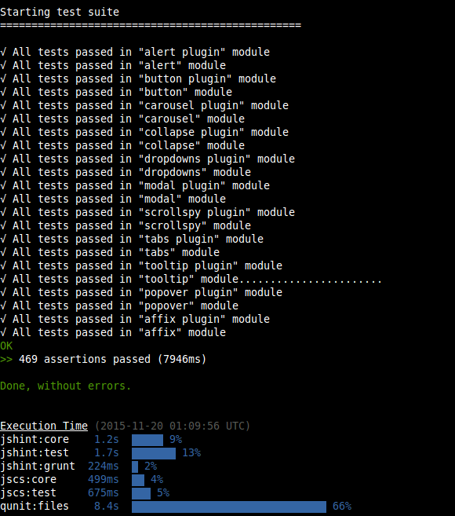

# Relatório 4 - ESOF
##Bootstrap - Verificação e Validação de Software

### Introdução

O objetivo deste relatório consiste na análise dos processos de verificação e validação (V&V) seguidos no desenvolvimento da biblioteca Bootsrap, com a descrição de algumas das características deste projeto que digam respeito à aplicação desses processos.

Numa primeira fase, explorar-se-á o grau de testabilidade do software, analisando a controlabilidade do estado dos componentes, a observabilidade dos resultados e a isolabilidade dos componentes, assim como o grau de separação de funcionalidades, de inteligibilidade dos componentes e de heterogeneidade das tecnologias utilizadas.

Numa segunda fase, serão apresentadas algumas estatísticas pertinentes relacionadas com a verificação e validação do software.

Finalmente, será realizado um exercício que consistirá na seleção de um bug report e na conceção de casos de teste que possam, eventualmente, conduzir à resolução do mesmo.

[JSHint, A Static Code Analysis Tool for JavaScript](http://jshint.com/about/)

JSHint é uma ferramenta que tem como finalidade detetar erros e potenciais problemas de código JavaScript, permitindo assim que os desenvolvedores se possam focar em escrever programas, não tendo a preocupação com alguns problemas como *typos* ou *language gotchas*. Uma das suas caracteristicas mais importantes é a sua flexibilidade que permite uma fácil adaptação a diferentes tipos de projetos.

[Grunt - The JavaScript Task Runner](http://gruntjs.com/)

Por que usar um *task runner*?

Porque permite automatizar as tarefas repetitivas inerentes ao desenvolvimento de software como a minificação e compilação, poupando desta forma tempo e esforço a quem o desenvolve.

[PhantomJS](http://phantomjs.org/headless-testing.html)

O principal uso de PhantomJS é testar abstratamente aplicações web. Não é, em si, uma framework de testes mas sim usado para correr testes, através de um *test runner* apropriado.

#####Test Frameworks

The following table summarizes the list of various test frameworks and the corresponding test runners. If the framework does not need an external/third-party runner, it is marked as "built-in".

[QUNIT](http://qunitjs.com/intro/)

QUnit é uma framework de testes para JavaScript. Surgiu pela necessidade de ter uma unidade de testes para código *client-side*. Por unidade de testes entenda-se um conjunto de funções que, dado um input, produz sempre o mesmo output.

[JSCS](http://jscs.info/)

JavaScript Code Style (JSCS) é uma ferramenta para detecção de anomalias no código JavaScript. Este tipo de ferramentas são particularmente úteis em linguagens de programação interpretadas, tal como o JavaScript.
Permite a configuração em específico para um projecto, tendo disponível mais de 150 regras de validação, incluindo estilos populares pré-definidos como jQuery e Google.

[jQuery](https://jquery.com/)

jQuery é a mais famosa e utilizada biblioteca de JavaScript. A sintaxe do jQuery foi desenvolvida com o intuito de tornar mais simples a navegação do documento HTML, a seleção de elementos DOM, a criação de animações, a manipulação de eventos e o desenvolvimento de aplicações AJAX.
Entre as suas principais características destacam-se: resolução da incompatibilidade entre navegadores, redução de código, reutilização do código através de plugins e implementação segura de recursos das várias versões de CSS.

###Testabilidade:

Iremos agora avaliar o quão testável o projeto *Bootstrap* é. Até que ponto é possível verificar e validar o mesmo em termos de implementação. É importante salientar que após uma análise do projeto podemos constatar que é utilizada a ferramenta *QUnit* que permite testar componentes da aplicação, através de testes unitários.

#####Controlabilidade:

A controlabilidade está relacionada com o grau com que é possível controlar o estado de uma componente a ser testada. Uma vez que o estado de cada uma das componentes princípais do *Bootstrap* é independente, é possível criar testes unitários para testar o estado de cada uma destas separadamente.

#####Observabilidade:

#####Observação:

Através da análise das ferramentas acima citadas, verifica-se que a equipa de desenvolvimento do Bootstrap tem preocupações no que diz respeito à eficácia do código desenvolvido assim como com a maneira como este é desenvolvido. Tentam automatizar tarefas e garantir que o código segue certas *guidelines* que o tornam menos propício a erros, assim como amplamente compatível.

