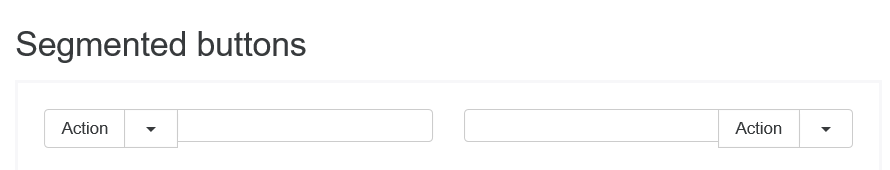
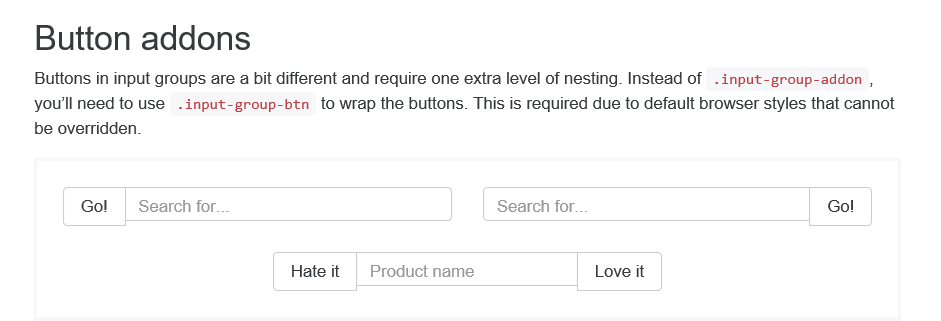
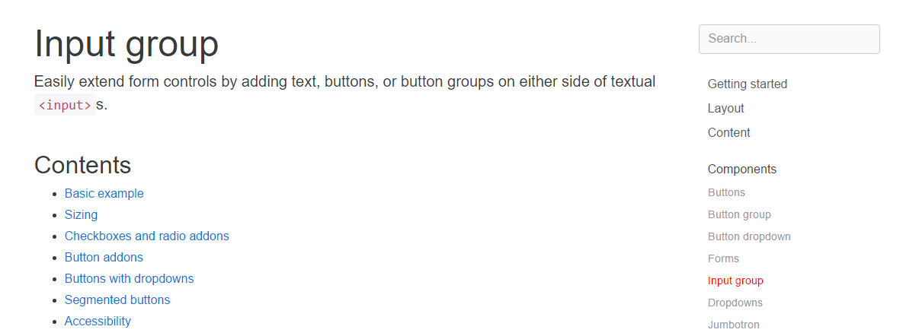
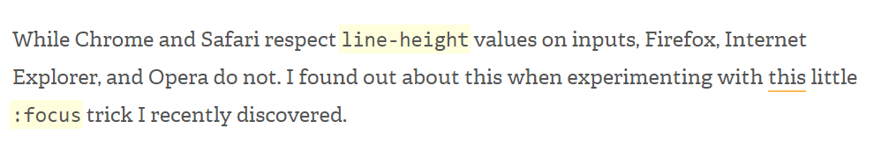
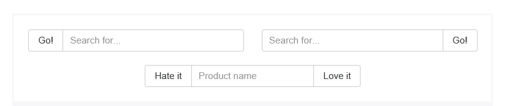
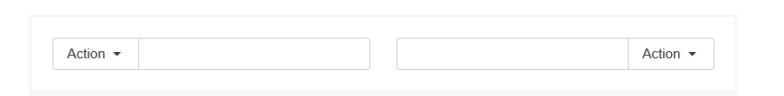
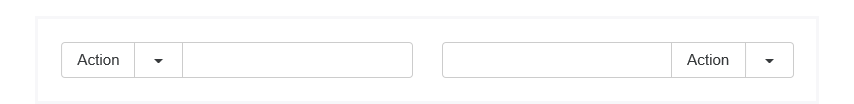
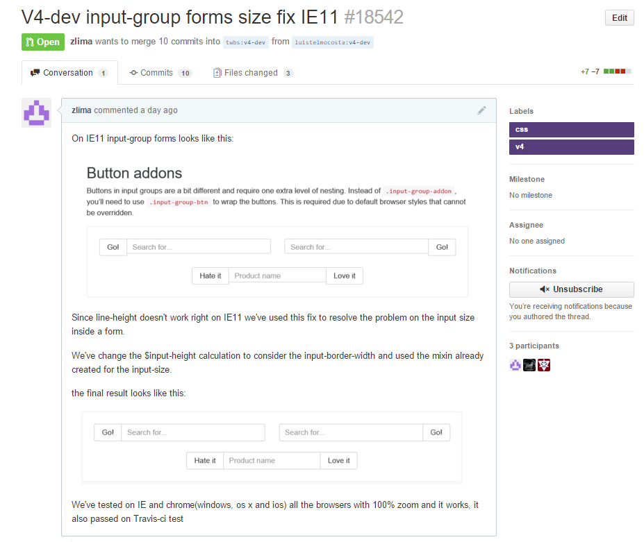

# Relatório 5 - ESOF
##Bootstrap - Evolução de Software

### Introdução
 
Na fase final do projecto desenvolvido na unidade curricular Engenharia de Software, foi-nos pedido para evoluir uma funcionalidade do *bootstrap* sem que as restantes funcionalidades fossem quebradas. 
Uma vez que a versão 4 do *bootstrap* se encontra em *alpha* optámos por utilizar a *branch* desta versão para tentar identificar e evoluir uma funcionalidade. 

### Identificação da Funcionalidade
 
Como já referido na introdução, optámos por tentar evoluir a nova versão do *bootstrap* que já se encontra em construção e em testes para ser lançada em breve. 
Identificar a *feature* a evoluir foi um processo relativamente simples, pois o site do *bootstrap* já nos oferece uma *live demo* das suas *features* e ao visitarmos o site com o *Internet Explorer 11* encontrámos logo uma série de possiveis melhoramentos a ser feitos no projeto. 
Na secção da componente *input-group* foi identificado que em todos os *forms* que tinham *inputs* estes não tinham o mesmo tamanho que as outras componentes que eram colocadas ao seu lado. 

> **Nota:** Como se pode observar nas imagens anteriores, os *inputs* não têm a mesma altura dos botões ao seu lado.

 
 
### Identificação dos Componentes que Implementam a Funcionalidade
 
A componente que implementa a funcionalidade acima apresentada é a do *Input-group*. Mais uma vez a estruturação do *site* do *bootstrap* ajudou bastante pois na *live demo* apresentada são logo indicadas as componentes que implementam as funcionalidades.
 

  

### Evolução da funcionalidade
 
Com a nova versão do *bootstrap* a equipa principal de desenvolvimento decidiou passar a gerar o seu *css* com [*sass*](http://sass-lang.com/) em vez de [*less*](http://lesscss.org/), os principais motivos descritos no site para esta mudança são a maior velocidade de compilação do código e a grande comunidade de *developers* que existe no *sass*. 
Depois de descarregar e compilar o código da versão 4 da *branch* [*v4-dev*](https://github.com/twbs/bootstrap/tree/v4-dev) fizemos vários testes na componente que implementa a funcionalidade que pretendiamos melhorar. Apercebemo-nos então que a propriedade de *css* que afectava o tamanho dos *inputs* era o *line-height*. Após alguma pesquisa e testes chegámos à conclusão que esta propriedade não funciona correctamente no *Internet Explorer 11*, que é um browser que o *bootstrap* suporta.
 

>**Fonte:** [http://joshnh.com/weblog/line-height-doesnt-work-as-expected-on-inputs/](http://joshnh.com/weblog/line-height-doesnt-work-as-expected-on-inputs/)

 
A solução que conseguimos encontrar para resolver este problema foi em vez de utilizar a propriedade *line-height* passar a usar a propriedade *height* no *css* pois esta comporta-se de igual forma em todos os *browsers* suportados pelo *bootstrap*. 
Ao analisarmos melhor o código *sass* encontrámos uma [*mixin*](http://www.sitepoint.com/sass-basics-the-mixin-directive/) já implementada que executava exactamente o que nós pretendiamos. Após incluirmos a [*mixin*](http://www.sitepoint.com/sass-basics-the-mixin-directive/) nos sítios onde era necessário e gerado o novo código os *inputs* continuavam com uma diferença minima de altura, fomos então ao código da versão 3 do *bootstrap* para perceber como era calculada a altura dos *inputs* e chegámos à conclusão que faltava incluir nos cálculos a largura do bordo dos inputs (*$input-border-width*). 
Este *fix* proposto por nós foi testado nos seguintes *browsers* com um zoom de 100%, não apresentando qualquer problema: 

- **Google Chrome**(iOS, OS X, Windows, Ubuntu); 
- **Safari**(iOS); 
- **Internet** **Explorer** **11**(Windows). 

 

>**Nota:** Resultado após a nossa proposta de *fix*.

 
 
### Pull Request  
Após o melhoramento da funcionalidade submetemos um *pull-request* na branch da versão 4 do *bootstrap*([*v4-dev*](https://github.com/twbs/bootstrap/tree/v4-dev)). 

>***Pull-request* link:** [https://github.com/twbs/bootstrap/pull/18542](https://github.com/twbs/bootstrap/pull/18542)

 
### Análise Crítica
Dado que o bootstrap é um projeto estruturalmente bem constituído e, uma vez que, atualmente se encontra disponível uma versão *alpha* da próxima *release* foi relativamente fácil identificar uma *feature* corrigível. No que diz respeito à sua implementação, o facto do css permitir obter um mesmo resultado utilizando diferentes *css rules*, foi fulcral para conseguir obter uma solução homogénea nos diferentes browsers suportados pelo Bootstrap.

 
### Apontamento Final
Para finalizar, o grupo considera que foi interessante a abordagem feita aos conteúdos programáticos desta Unidade Curricular, através da exploração de um projeto *open source* alojado no GitHub, porque permitiu ficarmos a perceber as diferentes fases do ciclo de vida do software, assim como, como os diferentes intervenientes colaboram na produção desse mesmo software.

 
### Informações

##### Autores:

* Luís Telmo Costa - up200806068
* José Carlos da Rocha Lima - ei10012
* Alexandre Marques de Castro Ribeiro - ee12288

Faculdade de Engenharia da Universidade do Porto - MIEIC

2015-12-12
