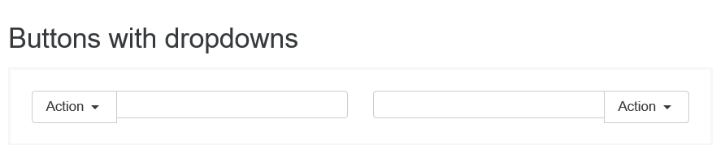

# Relatório 5 - ESOF
##Bootstrap - Evolução de Software

### Introdução
 
Na fase final do projecto desenvolvido na unidade curricualr Engenharia de Software, foi nos pedido para evoluir uma *feature* do *bootstrap* sem que as restantes funcionalidades fossem quebradas. 
Uma vez que a versão 4 do *bootstrap* se encontra em *alpha* optámos por utilizar a *branch* desta versão para tentar identificar e evoluir uma *feature*. 

### Identificação da Funcionalidade
 
Como já referido na introdução, optámos por tentar evoluir a nova versão do *bootstrap* que já se encontra em construção e em testes para ser lançada em breve. 
Identificar a feature a evoluir foi um processo relativamente simples, pois o site do *bootstrap* já nos oferece uma *live demo* das suas *features* e ao visitarmos o site com o *Internet Explorer 11* encontrámos logo uma série de possiveis melhoramentos a ser feitos no projeto. 
Na secção da componente *input-group* foi identificado que em todos os *forms* que tinham *inputs* estes não tinham o mesmo tamanho que as outras componentes que eram colocadas ao seu lado. 

> **Nota:** Como se pode observar nas imagens anteriores, os *inputs* não têm a mesma altura dos botões ao seu lado.

 
 
### Identificação dos Componentes que Implementam a Funcionalidade
 
A componente que implementa a funcionalidade acima apresentada é a do *Input-group*. Mais uma vez a estruturação do *site* do *bootstrap* ajudou bastante pois na *live demo* apresentada são logo indicadas as componentes que implementas as funcionalidades.
 

  

### Evolução da funcionalidade
 
Com a nova versão do *bootstrap* a equipa principal de desenvolvimento decidiou passar a gerar o seu *css* com [*sass*](http://sass-lang.com/) em vez de [*less*](http://lesscss.org/), os principais motivos descritos no site para esta mudança são a maior velocidade de compilação do código e a grande comunidade de *developers* que existe no *sass*.
Depois de descarregar e compilar o código da versão 4 da *branch* [*v4-dev*](https://github.com/twbs/bootstrap/tree/v4-dev) fizemos vários testes na componente que implementa a funcionalidade que pretendiamos melhorar. Apercebemo-nos então que a propriedade de *css* que afectava o tamanho dos *inputs* era o *line-height*. Após alguma pesquisa e testes chegámos à conclusão que esta propriedade não funciona correctamente no *Internet Explorer 11", que é um browser que o *bootstrap* suporta.
 

>**Fonte:**[http://joshnh.com/weblog/line-height-doesnt-work-as-expected-on-inputs/*](http://joshnh.com/weblog/line-height-doesnt-work-as-expected-on-inputs/)

 
  
### Informações

##### Autores:

* Luís Telmo Costa - 200806068
* José Carlos da Rocha Lima - ei10012
* Alexandre Marques de Castro Ribeiro - ee12288

Faculdade de Engenharia da Universidade do Porto - MIEIC

2015-12-12
